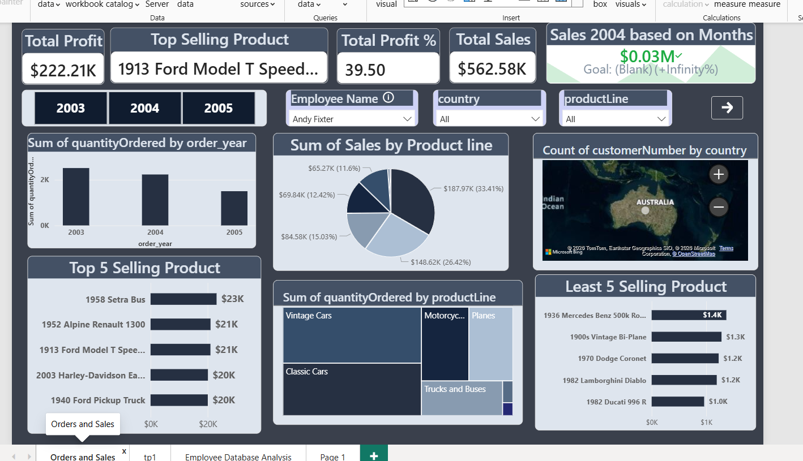
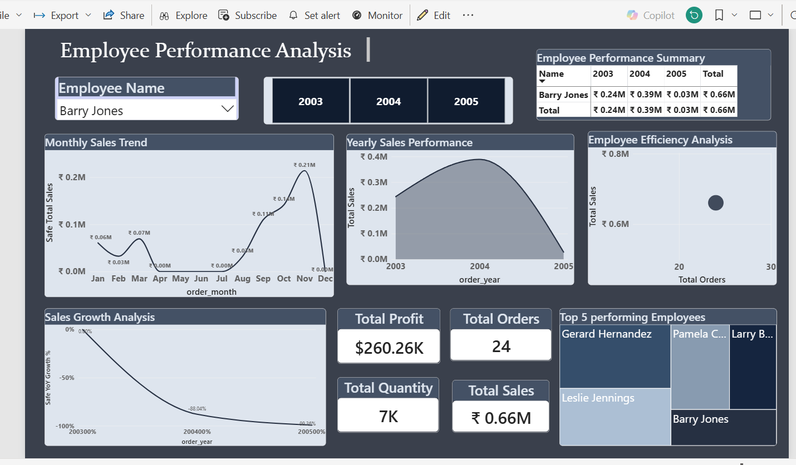
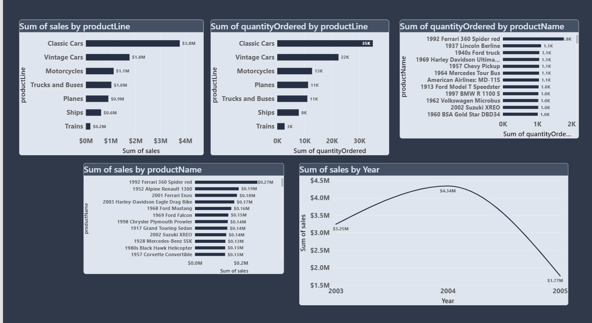

# 📊 Sales & Employee Performance Dashboard — Power BI

## 📌 Project Overview

An end-to-end interactive Business Intelligence project built using **Power BI Desktop**, analyzing sales performance, product trends, employee efficiency, and customer distribution for a Classic Models retail business across **2003–2005**.

This project focuses heavily on:

* Transforming raw relational data into meaningful business insights
* Building clean, interactive dashboards with professional design
* Writing reliable DAX measures with proper blank handling
* Designing a dashboard experience that is both analytical and visually intuitive

---
📌 Project Workflow
```
Raw Relational Dataset (MySQL-style tables)
        ↓
Data Modeling & Relationships in Power BI
        ↓
Data Transformation via Power Query
        ↓
DAX Measures & Calculated Columns
        ↓
Dashboard Design & Visualization
        ↓
Interactivity, Slicers & Cross-Filtering
        ↓
Business Insights & KPI Reporting
```
---
## 📌 About the Dataset

The dataset is based on a company sales and order management system for a Classic Models retail business, covering multiple vehicle categories including cars, motorcycles, planes, ships, trains, and trucks.

| Table          | Description                                                       |
| -------------- | ----------------------------------------------------------------- |
| `employees`    | Sales representative details, job titles, and reporting hierarchy |
| `customers`    | Customer information, country, and assigned sales representative  |
| `orders`       | Order dates, order status, and quantities ordered                 |
| `products`     | Product names, product lines, buy price, and MSRP                 |
| `productlines` | Product category descriptions                                     |

### 📅 Time Period Covered

**2003 · 2004 · 2005**

The dataset required careful data modeling and relationship building before analysis could begin. Tables were connected through relational links such as:

`customers → orders → products → employees`

This structured model enabled accurate KPI tracking, sales analysis, customer insights, and employee performance evaluation across the dashboards.

📂 Project Structure
```
sales-dashboard-powerbi/
│
├── dashboard.pbix               # Main Power BI project file
│
├── screenshots/
│   ├── sales_dashboard.png
│   ├── employee_dashboard.png
│   └── orders_dashboard.png
│
└── README.md
```
---
🖥️ Dashboard Preview
Page 1 — Sales & Product Performance

Page 2 — Employee Performance Analysis

Page 3 — Orders & Product Analysis

---
## 🏗️ Phase 1 — Data Modeling & Power Query

Before building any visuals, the raw tables were cleaned, transformed, and connected inside **Power BI** to create a reliable relational data model.

### 🔗 Relationships Built

The tables were linked using primary and foreign keys:

* `orders` ↔ `customers` using `customerNumber`
* `customers` ↔ `employees` using `salesRepEmployeeNumber`
* `orders` ↔ `products` using `productCode`
* `products` ↔ `productlines` using `productLine`

### ⚙️ Power Query Transformations

Several preprocessing steps were performed to improve data quality and enable accurate analysis:

* Assigned correct data types to all columns (dates, numbers, and text)
* Extracted `Year`, `Month`, and `Month Name` from order dates for time-based analysis
* Removed irrelevant and null-heavy columns
* Standardized and cleaned data for consistent reporting

---

## 🏗️ Phase 2 — DAX Measures

All KPIs, calculations, and business metrics were created using **DAX (Data Analysis Expressions)** to support dynamic and interactive dashboard analysis.

### 📊 Key Measures Written

Total Sales
```
Total Sales = SUMX(orders, orders[quantityOrdered] * orders[priceEach])
```
Total Profit
```
Total Profit = SUMX(orders, (orders[priceEach] - products[buyPrice]) * orders[quantityOrdered])
```
Profit %
```
Profit % = DIVIDE([Total Profit], [Total Sales], 0)
```
YoY Sales Growth
```
YoY Growth % = 
DIVIDE(
    [Total Sales] - CALCULATE([Total Sales], SAMEPERIODLASTYEAR('Date'[Date])),
    CALCULATE([Total Sales], SAMEPERIODLASTYEAR('Date'[Date])),
    0
)
```
Safe measures were used throughout to handle blank values and avoid division errors, ensuring visuals never broke on filtered or sparse data.
---
## 📄 Dashboard Pages

### 📊 Page 1 — Sales & Product Performance Dashboard

This page provides a high-level overview of overall business performance, product trends, and sales distribution.

#### 🔹 KPI Cards

* **Total Sales:** $1.77M
* **Total Profit:** $695.88K
* **Profit %:** 39.29%
* **Top Selling Product:** *1992 Ferrari 360 Spider red*
* **2004 Sales Goal Tracker:** $0.43M achieved vs $0.28M goal (**+54.97%**)

#### 📈 Visuals Included

* Order Quantity Trend (2003–2005) — Bar Chart
* Sales Distribution by Product Line — Pie Chart with Tooltips
* Product Line Performance Analysis — Treemap
* Top 5 Selling Products — Horizontal Bar Chart
* Lowest Performing Products — Horizontal Bar Chart
* Customer Distribution Across Countries — Map Visual

#### 🎛️ Slicers

`Year` · `Employee Name` · `Country` · `Product Line`

---

### 👨‍💼 Page 2 — Employee Performance Analysis Dashboard

This page focuses on analyzing individual employee performance, productivity, and sales contribution over time.

#### 📌 Important Design Decision

During development, it was observed that several employees had insufficient order data to generate meaningful trends or reliable comparisons. Instead of displaying incomplete or misleading visuals, the **Employee Name slicer** was configured to include only employees with adequate sales records. This ensured that all insights shown on the page remained accurate, relevant, and trustworthy.

#### 🔹 KPI Cards

* Total Sales per Employee
* Total Profit per Employee
* Total Orders Handled
* Total Quantity Sold

#### 📈 Visuals Included

* Monthly Sales Trend — Line Chart
* Yearly Sales Performance — Area Chart
* Employee Efficiency Analysis (Sales vs Orders) — Scatter Chart
* Sales Growth Analysis (YoY %) — Line Chart
* Top 5 Performing Employees — Treemap
* Employee Performance Summary — Matrix Table

#### 🎛️ Slicers

`Employee Name` · `Year (2003–2005)`

---

### 📦 Page 3 — Orders & Product Analysis Dashboard

This page provides a detailed product and category-level breakdown of order and sales performance.

#### 📈 Visuals Included

* Sum of Sales by Product Line — Horizontal Bar Chart
* Sum of Quantity Ordered by Product Line — Horizontal Bar Chart
* Sum of Quantity Ordered by Product Name — Horizontal Bar Chart
* Sum of Sales by Product Name — Horizontal Bar Chart
* Sum of Sales by Year (2003 → 2005) — Line Chart

---

## ✨ Key Business Insights

* Classic Cars generated the highest revenue contribution with **40.43%** share of total product line sales (**$3.8M overall**)
* *1992 Ferrari 360 Spider red* emerged as the top-selling product with **$0.27M in sales** and **$53K profit**
* Sales peaked in **2004** at **$4.34M** before declining significantly in **2005** to **$1.77M**
* The 2004 sales target was exceeded by **+54.97%**
* Gerard Hernandez ranked as the top-performing employee by total sales
* Trains recorded the lowest product line performance at only **$0.2M** in sales
* Faster-selling products were concentrated mainly within the Classic Cars and Vintage Cars categories

---

## ✨ Features & Techniques Used

| Feature                    | Detail                                                            |
| -------------------------- | ----------------------------------------------------------------- |
| **DAX Measures**           | Safe blank handling, `DIVIDE()`, `SUMX()`, `SAMEPERIODLASTYEAR()` |
| **YoY Growth Analysis**    | Year-over-year percentage growth using DAX                        |
| **Conditional Formatting** | Applied across KPI cards and matrix visuals                       |
| **Tooltip Integration**    | Custom tooltip pages for product-level analysis                   |
| **Cross-Filtering**        | Fully interactive visual relationships                            |
| **Slicers**                | Employee Name, Year, Product Line, Country                        |
| **Data Modeling**          | Multi-table star schema with relational structure                 |
| **Power Query**            | Data cleaning, type casting, and transformation                   |
| **Map Visual**             | Geographic customer distribution using Bing Maps                  |
| **Dark Corporate Theme**   | Consistent professional UI design                                 |

---

## 📊 Visuals Used

`KPI Cards` · `Line Charts` · `Area Charts` · `Scatter Charts` · `Pie Charts` · `Treemaps` · `Horizontal Bar Charts` · `Map Visuals` · `Slicers` · `Matrix Tables`

---

## 🚀 How to Use

1. Download the `dashboard.pbix` file from this repository
2. Open the file using **Power BI Desktop**
3. Use slicers to filter by Employee, Year, Country, or Product Line
4. Hover over visuals to view additional tooltip insights
5. Click visual segments to cross-filter the entire dashboard dynamically

---

## 🛠️ Tools Used

* Power BI Desktop
* DAX (Data Analysis Expressions)
* Power Query (M Language)
* Bing Maps

---

## 🧠 Key Learning Outcomes

This project strengthened understanding of:

* Relational data modeling inside Power BI
* Writing reliable DAX measures for dynamic analysis
* Designing effective slicer logic for accurate reporting
* Building business-focused dashboards instead of purely visual reports
* Creating professional, interactive BI experiences with meaningful insights

One of the most important design decisions during this project was excluding employees with insufficient data from performance analysis, ensuring that incomplete information was never presented as reliable business insight.

---

Built as a hands-on learning project to strengthen practical Business Intelligence, Power BI, DAX, and dashboard design skills.
and real-world BI dashboard development using Power BI.
